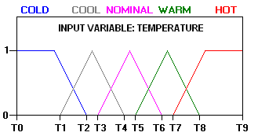
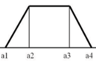
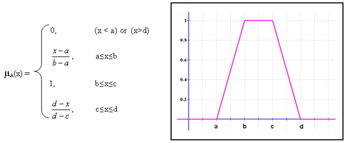

# Exámen Práctico Integrador TC1028 - 414

Este exámen debe ser entregado de la siguiente forma:

- En eLumen (Canvas) en un archivo *comprimido (zip)*
- En *GitHub Classroom*

El exámen consta de dos ejercicios, cada uno deberá ser creado en su propio **archivo py**.

Cuentan con un archivo **test1.py** para realizar las pruebas y verificar que sus métodos se ejecutan correctamente.

## El tiempo de exámen es de 2 horas , tanto Canvas como GutHub tiene de limite el final de la clase.

Ambos ejecicios deberán de contar con los siguientes puntos a calificar.

1. Algoritmo de solución (code2flow) que contará por 10 puntos
2. Docstring completo y que tu código se ajuste a las convenciones de estilo del lenguaje Python (10 puntos)
3. Los puntos restantes serán otorgados en la correcta implementación de lo solicitado.

------

## Ejercicio 1 : (40 puntos)

En un archivo llamado **vocales.py** escribe un método llamado **cuenta_vocales**, dicho método debe de recibir como argumento un **string** (el cual contiene una palabra), debe **regresar** el número de vocales y de consonantes  que contiene , esta información debereá regresarse en una **lista**, el primer elemento de la lista será el número de vocales y el segundo, el número de consonantes.

Los puntos a implementar son:

- Uso de ciclos
- Uso de strings
- Uso de decisiones
- Uso de listas

Por ejemplo si ejecutaramos el métodoy el argumento fuera "biblioteca" el método regresaria

`[5, 5]`

------

## Ejercicio 2 : (60 puntos)

En un sistema "fuzzy" requerimos definir un grupo de conjuntos difusos para definir una "VARIABLE" física como temperatura, humeda, presión, velocidad o fuerza.

Cada una de estos conjuntos difusos están representados por 4 valores.

En un archivo que se llame **fuzzy.py** defina un método que se llame **calculo_membresia** que reciba:

- Una "matriz" que contiene listas, y cada una de ellas representa un conjunto difuso definidos con estos 4 valores enteros 
- El valor con el que vamos a calcular la membresía  de este en el conjunto difuso.

El cálculo de la membresía se realiza de la siguiente forma.

Los valores de membresía de cada uno de los conjuntos difusos serán almacenados en una lista que  se regresará como resultado del método.

Ejemplo de regreso:

`[0.5 , 0.5 ,  0.5 , 0.5]`

Los puntos a implementar son:

- Uso de matrices
- Uso de ciclos
- Uso de decisiones
- Uso de listas
- Operaciones matemáticas